<div align="center">


# Ultimate Sim App

**A Windows sim‑racing companion + DIY ButtonBox project** — live telemetry, GT3‑grade dashboards, transparent overlays, race strategy, and a **100% local, offline AI engineer & coach** that runs on your CPU with **no GPU and no cloud cost**.

Independent community project maintained by Guilherme Basso · Electron + React + TypeScript · Apache‑2.0

[](https://buymeacoffee.com/bettercalllbasso)


</div>

---

## 🧠 Local AI — no GPU, no cost, fully offline

The **AI Engineer**, **Live/AI Coach**, and **lap analysis** run **entirely on your machine, on the CPU**:

- **No GPU required** — the bundled LLM uses the CPU‑only `node-llama-cpp` backend (GPU/CUDA/Vulkan variants are intentionally excluded from the build).
- **No cost, no cloud, no account** — nothing is sent to an external API; there are no per‑request charges or subscriptions.
- **Works offline** — the race engineer, driving coach, semantic search, and neural voices operate without an internet connection.

> In short: the intelligent features are yours, private, free, and GPU‑free.

---

## ✨ What's new in this release

A ground‑up rebuild of the visual layer and UX:

- **250+ telemetry widgets** from a *variable × form* factory — every channel can be shown as a **bar, vertical bar, gauge, 7‑segment, LED, 32‑bit pixel, ring, tile, or big number** (≥ 5 forms per variable, 500+ combinations).
- **50+ overlays**, each rendering in **≥ 5 visual styles/design families** (minimal, neon, glass, broadcast, terminal, bauhaus, analog, heatmap).
- **200+ new dashboards** across **8 generic car families** × 5 layouts (DDU cockpit, engineer wall, endurance, strategy, broadcast) × 5 resolutions (800×480 → 1920×1080 + portrait).
- **Car‑context theming** with original, trademark‑free codename liveries: *Woking, Maranello, Gaydon, Stuttgart, Bowtie, Affalterbach, Ingolstadt, and a Le Mans/IMSA‑style Prototype*.
- **Collapsible sidebar** (icon‑only rail, `Ctrl/Cmd+B`, persisted) and a refreshed, image‑driven menu.
- **New app icon** and AI‑generated hero art (Azure AI Foundry `gpt-image`), used for reference and menu context only — no readable logos or sponsor marks.
- **English is now the primary language**, with switchable **Português, Deutsch, Français, 中文, Español, 日本語**.

All widgets/overlays/dashboards are **NaN‑safe** and verified by the visual‑audit harness (0 render errors, 0 overflow, 0 overlap) and the unit suite (**2,789 tests green**).

---

## 🏁 Features

### Sim Racing
- **Telemetry** — live source selection (Off / Auto / Demo mock / **iRacing / ACC / AC / AMS2 / LMU**) with a live overview.
- **Dashboards** — monitor windows, `.simhubdash` import, drag‑and‑drop builder, and 200+ built‑in GT3/endurance presets.
- **Adaptive Dashboard** — a single dashboard that reorganizes itself by session phase and lap moment.
- **Touch Controls Dash** — touch pit panel and editable RGB button boxes for a cockpit screen.
- **OLED Dashboard** — selectable presets that rotate on the ButtonBox OLED (128×64 preview).
- **Overlays** — transparent windows over the game: rev/shift lights, gear+speed, delta, inputs, fuel, relative/standings (multiclass), flags, tyres/brakes, weather, radar.
- **Fuel** — usage per lap, laps‑to‑empty, fuel‑save target, pit window, stint planner.
- **Tyres** — wear, per‑lap degradation rate, and pit window.
- **Strategy** — pit window, fuel margin, undercut/overcut, and incident clips.
- **Alerts** — pit limiter, flags, low fuel, and shift warnings (Web Audio beeps).
- **Expressions** — custom fields and conditions via a safe, CSP‑compatible evaluator (no `eval`).
- **Race Profiles** — car/track profiles (HID map + OLED + overlays + alerts + bindings) with auto‑switch.
- **Sounds** — Soundshift gear‑shift beep, incident, ABS and TCS audio cues (per‑car, self‑learning shift RPM).
- **Setups** — auto‑install `.sto` setups from a local folder or an https URL.
- **Career & Ratings** — iRating, Safety Rating, licenses, incidents, and results.
- **Biometrics** — heart rate, stress vs pace, and an AR HUD.
- **Haptics / Zonal Haptics** — ShakeIt‑style bass‑shaker + tactile feedback mapped to zones, with a visual simulator.
- **3D Spotter** — HRTF spatial‑audio cues for nearby cars.
- **Community** — local‑first ghosts, telemetry, and setups via `.simshare` files.

### AI & Coaching (local, CPU‑only, free)
- **AI Engineer** — text race engineer for fuel, tyres, gaps and strategy, plus a **Voice Spotter** (Local LLM).
- **AI Coach** — driving coach and lap analysis with corner findings, track map, and setup suggestions (Local AI).
- **AI Dashboard** — build dashboards by describing them in plain text (Local LLM).
- **Semantic Search** — meaning‑based search across setups, ghosts, notes and findings (local embeddings).
- **Voice / TTS** — offline neural voices, system fallback, and wake‑word.

### ButtonBox / SIM‑X hardware
- **Devices** — USB/serial detection and ButtonBox selection.
- **Arduinos** — SimHub‑style hardware hub for RGB, matrix, displays, gauges, controls, pinout and firmware.
- **Rev Lights** — rev‑light configuration and presets.
- **Input Monitor** — live validation through the Web Gamepad API.
- **Controls & Keyboard** — button → key, virtual gamepad, iRacing command, or app action.
- **Pinout Designer** — low‑code drag‑and‑drop pin map plus firmware generation.
- **Profiles** — save and load hardware/race configurations.

### App
- **Settings** — auto‑start with Windows, default telemetry source, **language (7)**, and theme.
- **About / Credits** — licenses, fonts, and third‑party components.

---

## 📸 Screenshots

| App icon | GT3 dashboard (Maranello · DDU cockpit) |
|---|---|
|  | 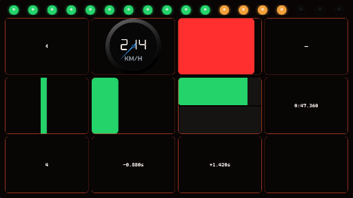 |

| Engineer wall (Stuttgart) | Broadcast (Gaydon) |
|---|---|
| 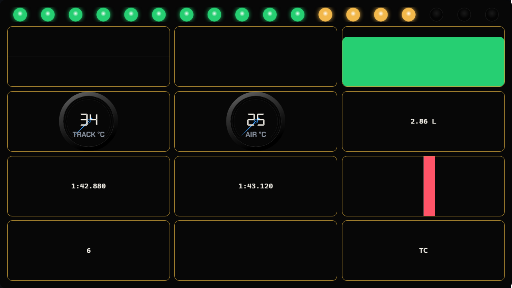 | 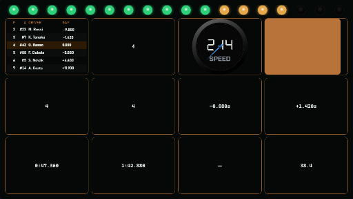 |

| Endurance stint (Prototype) | Strategy desk (Bowtie) |
|---|---|
| 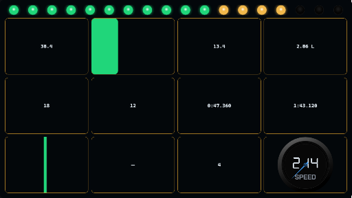 | 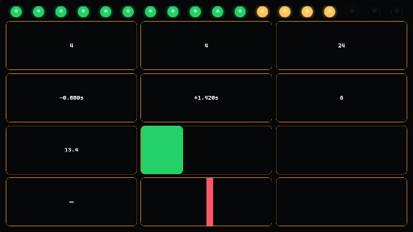 |

| Telemetry workspace | Overlay manager |
|---|---|
| 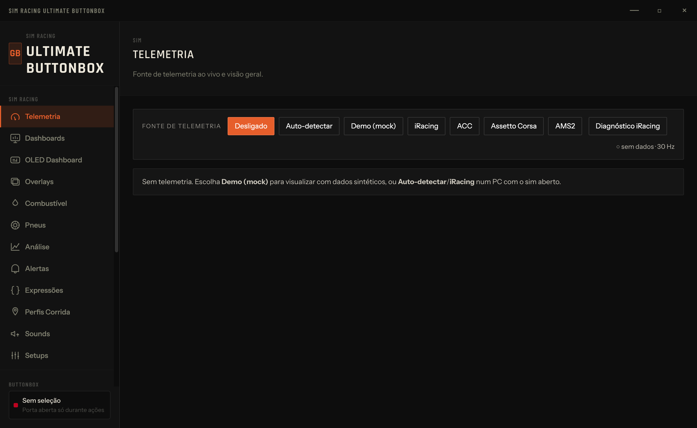 | 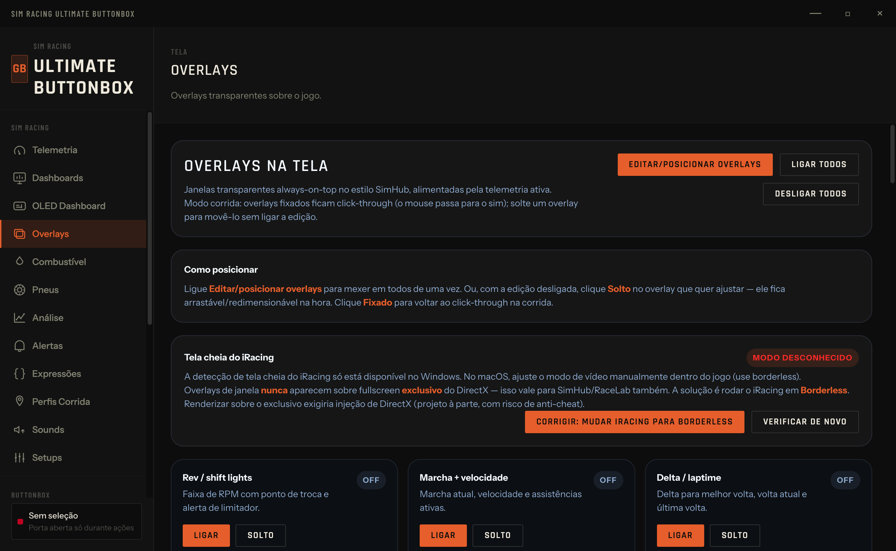 |

| AI coach / driver insights | Voice spotter |
|---|---|
| 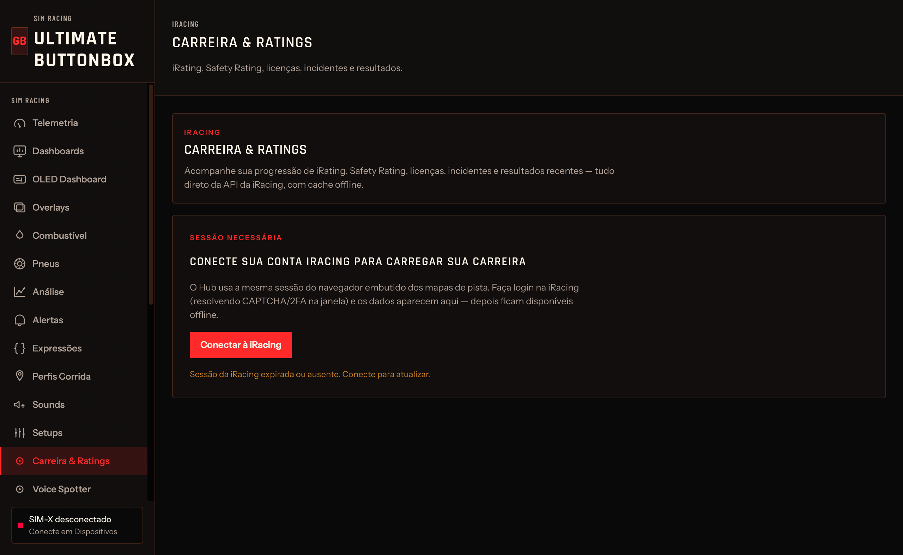 | 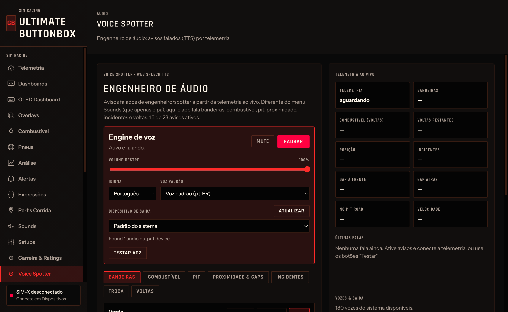 |

| Pinout designer | Controls & keyboard mapping |
|---|---|
| 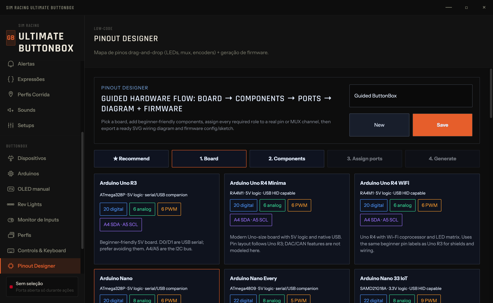 | 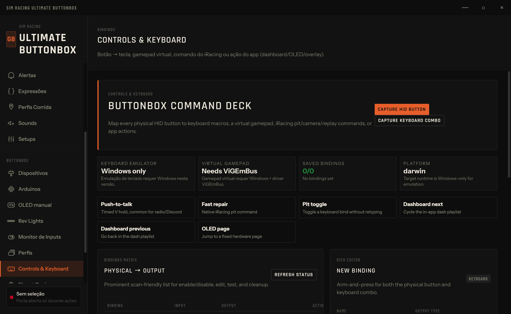 |

---

## 📦 What's included

| Area | Path | Description |
|---|---|---|
| Desktop app | `app-v2/` | Electron + React + TypeScript Windows app. |
| Firmware | `firmware/` | Arduino sketches for the ButtonBox and companion modules. |
| Driver helper | `driver/` | Optional INF package for friendly COM‑port naming using the Windows inbox `usbser.sys`. |
| Protocol docs | `docs/` | Serial protocol and implementation notes. |
| SimHub config | `simhub/` | Custom serial template for OLED telemetry. |
| CAD/print files | `cad/`, `print/` | 3D‑printable enclosure sources/assets. |

---

## 🌍 Languages

English (primary) · Português · Deutsch · Français · 中文 (Simplified) · Español · 日本語. `Auto` follows the Windows/OS language and falls back to English. Change it in **Settings → Language**.

---

## 🚀 Quick start for users

1. Download a trusted release build when available (see [Releases](../../releases)).
2. Install or unzip the Windows package.
3. Connect the ButtonBox by USB.
4. Open Ultimate Sim App and select the device/COM port.
5. Keep SimHub closed while configuring the serial device, then close/disconnect the app before racing if SimHub needs the same COM port.

See the full user guide in [`MANUAL.md`](MANUAL.md).

> **Telemetry is Windows‑only** (the sims live on Windows). On other platforms, or without a live session, use the **Demo (mock)** source to explore and configure everything.

---

## 🛠️ Development setup

Requirements: Node.js 20+, npm, Git, and Windows 10/11 for final installer validation.

```bash
cd app-v2
npm install
npm run dev
```

Useful checks:

```bash
npm run typecheck   # tsc (node + web)
npm run test        # vitest (2,789 tests)
npm run build       # electron-vite bundle
npm run visual:dash # render every dashboard preset and report errors
```

Build the Windows installer (on Windows):

```bash
cd app-v2
npm run dist:win
```

---

## 🔩 Hardware and firmware

The reference ButtonBox uses:

- Arduino Pro Micro / Leonardo‑compatible ATmega32U4 board
- 6 EC11 rotary encoders with push buttons
- SSD1306 OLED display
- CD74HC4067 multiplexer

Firmware and wiring docs live under `firmware/`, `docs/`, `simhub/`, `BOM.*`, and `WIRING.*`.

---

## 🤝 Contributing

Contributions are welcome. Start with [`CONTRIBUTING.md`](CONTRIBUTING.md), open an issue for larger changes, and keep changes focused. Pull requests must be reviewed and approved by the maintainer before merge.

Generated dependencies and build outputs (`node_modules/`, `app-v2/out/`, `app-v2/dist-win/`, logs/caches) are intentionally not committed. Release installers are generated from source and attached to GitHub Releases after review.

---

## ❤️ Support

If this project helps your sim racing setup, you can support development here:

[](https://buymeacoffee.com/bettercalllbasso)

## 📄 License

Licensed under the Apache License, Version 2.0. See [`LICENSE`](LICENSE).
