<div align="center">


# Ultimate Sim App

**Ultimate Sim App** is a local-first Windows cockpit companion that turns live telemetry into race-ready GT3/DDU dashboards, transparent overlays, fuel and tyre strategy, alerts, phone/tablet streams, local Coach/Engineer workflows, and SIM-X/Arduino/ESP32 controls.

Independent community project maintained by Guilherme Basso · Electron + React + TypeScript · Apache-2.0

Release line: **Ultimate Sim App 2.53.1** · [Latest published Windows x64 downloads](https://github.com/guilhermerbasso/ultimate-sim-app/releases/latest)

Development builds use the version in [`app-v2/package.json`](app-v2/package.json) and may be ahead of the latest published release.

[](https://buymeacoffee.com/bettercalllbasso)


</div>

---

## Current feature set

Ultimate Sim App brings live race telemetry, dashboard composition, transparent overlays, strategy, alerting, streaming, hardware control, and local AI into one desktop app. It is built for Windows racing rigs, second monitors, cockpit tablets/phones, and DIY devices, with the deepest telemetry integration on iRacing and narrower source-dependent coverage on ACC, Assetto Corsa, AMS2, and LMU.

## What's new

<!-- WHATS_NEW:START -->
### 2.54.0 — managed streaming, local integrations, and offline race preparation

- **Connect local tools through a hardened MQTT target** ([#70](https://github.com/guilhermerbasso/ultimate-sim-app/pull/70)): it is disabled by default, binds only to loopback (`127.0.0.1` / `::1`), separates authenticated publisher, reader, and command roles, and keeps command execution off unless explicitly enabled.
- **Choose and keep your own Streaming targets** ([#71](https://github.com/guilhermerbasso/ultimate-sim-app/pull/71)): the dedicated Streaming area stores dashboard and Touch Controls profiles, and edited dashboard copies remain available after migration and restart.
- **Share securely over the Internet without manual tunnel setup** ([#72](https://github.com/guilhermerbasso/ultimate-sim-app/pull/72)): Internet mode can start the bundled checksum-verified Cloudflare quick tunnel, establish the authenticated viewer session, show receiver health, and reconnect with bounded retries.
- **Practice race operations completely offline** ([#73](https://github.com/guilhermerbasso/ultimate-sim-app/pull/73)): Mission Rehearsal supports branching scenarios, assigned roles, checkpoints, resume/archive recovery, repeat comparisons, and scored blameless debriefs.
- **Prepare exact phone and tablet presentations** ([#74](https://github.com/guilhermerbasso/ultimate-sim-app/pull/74)): save revision-bound mobile profiles with device presets, orientation, safe areas, fit/fill behavior, and minimum touch sizing without changing the source dashboard or Touch Controls panel.
- **Position trigger-only visuals before they fire** ([#75](https://github.com/guilhermerbasso/ultimate-sim-app/pull/75)): an editor-only toggle reveals inactive trigger-based overlays and dashboard widgets without changing saved rules, live visibility, compositor output, or streams.
- **Audit cockpit Context-Debt experimentally** ([#76](https://github.com/guilhermerbasso/ultimate-sim-app/pull/76)): a local pre-race meter finds competing cues, invalid routes, and unavailable devices. It remains an N=0 experiment—not a validated demand or predictive-accuracy claim.
- **Compare one setup change with evidence instead of guesswork** ([#88](https://github.com/guilhermerbasso/ultimate-sim-app/pull/88)): the local Setup Experiment Twin guides manual A-B-A/B-A-B comparisons, reports uncertainty and conflicting evidence honestly, and never applies a setup automatically.
- **Reconnect the local PWA receiver without duplicate sockets or metrics** ([#90](https://github.com/guilhermerbasso/ultimate-sim-app/pull/90)): duplicate close/online triggers preserve the first pending 250 ms reconnect deadline, while offline and unmount cleanup still cancel pending work.
- **Share deterministic local setups through signed offline collaboration** ([#91](https://github.com/guilhermerbasso/ultimate-sim-app/pull/91)): Ed25519 actor signatures, canonical CRDT ordering/checksums, atomic rollback, strict size limits, and prototype-safe imports protect the workspace without enabling network transport.
- **Exercise Twitch, YouTube, and Discord workflows without contacting them** ([#93](https://github.com/guilhermerbasso/ultimate-sim-app/pull/93)): deterministic local simulations cover chat, events, polls, moderation, markers, clips, broadcasts, commands, and room policies with zero live egress, no live credentials, and no claim of production adapter support or platform certification.
- **Use saved Touch Controls securely from a phone or tablet** ([#94](https://github.com/guilhermerbasso/ultimate-sim-app/pull/94)): authenticated, target-bound capabilities allow only governed simulator actions, require CSRF/nonces/origin checks and a live receiver lease, and fail closed while releasing every hold or latch safely.
- **Review league incidents with evidence and human-owned verdicts** ([#95](https://github.com/guilhermerbasso/ultimate-sim-app/pull/95)): the local Steward Desk preserves verified case history, rules, dissent and appeals, anonymizes exported evidence, gates redistribution rights, and never adjudicates or applies penalties automatically.
- **Training stays separate from racing:** rehearsal events never enter real telemetry or session history, and rehearsal decisions cannot actuate live race controls.

### 2.53.1 — SerialPort startup hotfix

- Fixes the v2.53.0 packaged-app startup error where Electron could not resolve `serialport` from
  `app.asar`.
- Routes SerialPort through an ASAR-aware CommonJS bridge instead of the failing ESM resolver.
- Adds packaged-bundle inspection and a real packaged Electron resolver smoke test.

### 2.53.0 — reliable dashboard restart, telemetry truth, and governed visual foundations

- **Saved dashboard windows recover safely after restart** ([#64](https://github.com/guilhermerbasso/ultimate-sim-app/pull/64)): supported elements, including composed `overlaywidget` dashboards, survive validation and migration; invalid files are preserved in quarantine; replacement is atomic; and renderer/storage failures surface diagnostics instead of a black window.
- **Fuel range is litre-canonical** ([#62](https://github.com/guilhermerbasso/ultimate-sim-app/pull/62)): startup, partial, and refuelling laps no longer contaminate consumption samples, while engine map and throttle map remain distinct and garage cold pressure is not presented as live tyre pressure.
- **Alert behavior is consistent across alerts, overlays, dashboards, and widgets** ([#62](https://github.com/guilhermerbasso/ultimate-sim-app/pull/62)); configuration updates are serialized and Shift Point uses native shift state or RPM/max-RPM while respecting disabled policies and simulator coverage.
- **Visual-pipeline foundations are now governed** ([#60](https://github.com/guilhermerbasso/ultimate-sim-app/pull/60), [#61](https://github.com/guilhermerbasso/ultimate-sim-app/pull/61), [#63](https://github.com/guilhermerbasso/ultimate-sim-app/pull/63)): an immutable 50-dashboard brief portfolio, a clone-rejection differentiation gate, and a registry of 143 telemetry concepts (142 currently visualizable) plus 45 trigger-only families.
- **In development, not shipped in 2.53.0:** the separate Phase 02 program targets 50 newly produced dashboards and 16,600 individually evidenced visual artifacts. This release ships the portfolio, telemetry registry, and quality gates—not those generated images or dashboard outputs.

### 2.52.0 — semantic controls, expression destinations, secure streaming, and language-correct speech

- **Touch Controls schema v2** adds momentary, latching toggle, rocker, guarded two-step, rotary, selector, status LED, and value-tile controls with expression-driven states and accessible interaction.
- **Expression Studio destinations** can place custom expressions or mapped iRacing variables on a selected dashboard or custom overlay with value, bar, gauge, or status presentations.
- **Streaming hardening** adds prefix-safe resource discovery, HttpOnly viewer sessions, authentication throttling, capacity isolation, explicit HTTPS requirements for Internet mode, and fail-closed browser controls.
- **Trigger-only race overlays** now use temporal rising/falling edges, pulses, TTL windows, preview isolation, and replay/session reset boundaries; normal steady green no longer activates race-control alerts.
- **Speech language synchronization** keeps Spotter, Coach, Engineer, voice previews, and Stint Debrief text aligned with the selected voice/language and cancels stale speech when language changes.
- **Visual and catalog reliability** fixes 19 release-blocking widget layouts, preserves expression output recency, and keeps newly released overlays, widgets, and dashboards ahead of older catalog entries.

### 2.50.0 — Intent- & racecraft-aware AI Coach

- The local **AI Coach** now infers **driver intent** (racecraft, stint management, track/session conditions) over a time window before calling anything a mistake — deterministic and local-first, **no cloud LLM, no black-box ML**.
- **Golden rule**: an event is only flagged when no legitimate intent explains it, it **repeats lap-to-lap**, and there is real time loss; otherwise it stays **silent** or is kept as neutral **context**. Silence beats noise.
- **Confidence per finding + a "Coach sensitivity" slider**; grounded tips cite **Turn + Sector together**, the driving dimension in plain words, the seconds lost and the discarded intent — e.g. *"Turn 13 (Sector 3): not enough steering — lost 1.0s"*.
- **Local per-car + per-track baselines** (robust median/MAD/EMA + lap-to-lap repetition) tell the driver's **style** apart from an **error**; the local LLM only *verbalizes* the decided finding (PT-BR/EN). Research write-up in `app-v2/docs/coach-intent-research.md`.

### 2.49.0 — Overlay/widget fixes, device flashing & guided setup

- **Overlay/widget rendering fixes**: transparent, title-less, border-less overlays where reported; numbers no longer clipped; rev-lights/RPM strips fill the box width; the editor preview renders the real widget with simulated telemetry.
- **New overlay style editor**: colors, fonts, background, borders + border color, and divider lines — including hi-fi widgets.
- **Device flashing fixed**: `avrdude.exe` is bundled (with a download fallback); **iFlag** fixes (all serial ports listed, stable reconnect, persisted state, logging) plus a **guided setup wizard** for unknown devices and a **Custom serial devices** submenu.
- **Streaming**: fixed "Test from this PC → Failed to fetch" and added a **stream target selector** to choose which dashboard to stream.
- **Per-menu tutorials** (first-run walkthrough + a persistent "Start this menu's tutorial" button), a **Join us on Discord** button, a **Check for updates** button, and a fixed Windows taskbar/Start **app icon**.

<!-- WHATS_NEW:END -->

### iRacing telemetry widgets, overlays, and GT3 dashboards

- **423 generated iRacing telemetry variants** for 141 three-style concepts, plus the dedicated shift-light implementation and specialized alert, derived, and car-themed widgets.
- The governed registry covers **143 ordinary telemetry concepts**: 142 are currently visualizable, 141 use the competition/futuristic/DDU framework, shift lights use the dedicated shared implementation, and opponent steering remains explicitly unavailable because providers do not expose normalized opponent steering.
- **Per-car themed widgets** for Ferrari, Porsche, Mercedes-AMG, McLaren, Corvette, and Lamborghini visual families.
- **Themed channel widgets** plus full-frame GT3 DDU/cluster dashboards with shift LEDs, gear, speed, RPM, delta, TC/ABS, brake bias, tyres, fuel, and engineer pages.
- **NaN-safe rendering**: absent telemetry is shown as empty or placeholder data instead of fake values.

### Dashboards and cockpit displays

- **Dashboard builder/editor** with live preview, duplicate-and-edit workflow, monitor selection, import/export, and open-on-display support.
- **336 built-in dashboard presets**, including 50 dense 1024×600 GT3 layouts for qualifying, sprint, race, and endurance use.
- **Restart-safe persistence** validates and migrates dashboard identities, preserves invalid bytes in quarantine, resolves duplicate/version conflicts, restores saved windows atomically, and reports storage/render failures instead of leaving a black dashboard.
- **Race playlist** support can interleave dashboards and Touch Controls panels and cycle them from mapped hardware buttons.
- **Read-only dashboard streaming** in local, LAN, or Internet mode, with a dedicated Streaming area, persistent user-managed dashboard and Touch Controls targets, revision-bound phone/tablet presentation profiles, HttpOnly viewer sessions, authentication throttling, capacity isolation, stream-safe identity masking, debounced PWA receiver reconnects, and either a verified public HTTPS URL or the bundled checksum-verified Cloudflare quick tunnel.
- **Authenticated interactive Touch Controls streaming** for allowlisted pit actions, radio holds, toggles, selectors, rotaries, and simulator actions, with target-bound capabilities, CSRF/replay protection, origin binding, rate limits, a live receiver lease, generation-fenced heartbeat recovery, and fail-closed ownership cleanup.
- **Adaptive dashboards** that show/hide or emphasize widgets according to session phase and live race context.
- **AI dashboard builder** that assembles a preview from a plain-English description, with an offline keyword fallback when the local model is unavailable.
- **OLED Dashboard** presets for 128x64 ButtonBox displays.
- **Touch Controls Dash schema v2** for semantic momentary, toggle, rocker, guarded, rotary, selector, status-LED, and value-tile controls, with expression-driven states, keyboard ownership cleanup, accessible interaction, and editable RGB button boxes.

### Overlays and race awareness

- Transparent overlay windows for gear/speed, delta, inputs, fuel, relative/standings, flags, tyres, brakes, weather, radar, rev lights, and telemetry widgets.
- **Trigger-only condition overlays** for spotter/proximity, pace-car and pits-open messages, DRS, pit service, repairs, weather, race-control flags, incidents, shift flash, pit limiter, and low fuel, with pulse/TTL behavior, replay/session-safe resets, and an isolated editor-only preview toggle for positioning inactive visuals.
- **Interactive 3D Waze-style navigation map** with follow-camera track-up behavior, zoom, pan/rotate, recenter, layout-specific learned outlines/corners, replay-safe learning pauses, and a 2D fallback where WebGL is unavailable.
- Overlay editing, positioning, import/export, and compositor mode for one transparent window per display.

### Strategy, audio, haptics, and hardware

- **Fuel and tyre strategy**: litre-canonical fuel-per-lap and range, filtered consumption samples, laps remaining, stint planning, tyre wear, degradation, pit windows, and undercut/overcut guidance.
- **Team Fuel · LAN** rooms share same-session fuel, fuel-per-lap, laps remaining, stint targets, and pit-window state between peers using the same room key.
- **Rev-lights configuration** with presets, color bands, shift points, and live preview for SIM-X hardware.
- **Sounds/audio cues** for shift beeps, incidents, ABS, TCS, and race warnings.
- **Haptics and zonal haptics** for bass shakers/tactile feedback mapped to cockpit zones.
- **Arduino and ESP32 device support** for RGB, matrix LEDs, displays, gauges, controls, pinout design, and firmware-oriented workflows.
- **Loopback-only MQTT certification target**, disabled by default, with authenticated roles, narrow topic permissions, retained health/session state, and command execution disabled unless explicitly enabled.
- **Input monitor, controls, and keyboard bindings** for buttons, axes, keystrokes, virtual gamepad actions, iRacing commands, and app actions.

### Live/replay and configuration safety

- iRacing telemetry is classified as confirmed live, replay, or unknown. Live-only Coach/Engineer findings, predictions, fuel/tyre/lap strategy, adaptive moments, biometrics, community capture, Team Fuel, alerts, SoundShift, and track-map learning reset or pause outside confirmed live telemetry.
- Returning to live starts from reset or seeded state to avoid stale findings and duplicate alerts.
- Full-profile export remains available. Full-profile import is temporarily disabled to protect existing configuration; use per-section import controls instead. Credentials, tokens, sessions, logs, recordings, and track-map caches are excluded from configuration exports.
- These controls are live-data safety boundaries, not a claim that replay analysis is complete.

### Local AI, search, and community tools

- **AI Engineer** for fuel, tyres, gaps, strategy, and race questions using local telemetry context.
- **AI Coach** for lap analysis, corner findings, and improvement points — intent- and racecraft-aware for overtaking, defending, general improvement, and qualifying context; honest when opponent controls are unavailable; and cleared outside confirmed live telemetry.
- **Semantic Search** across setups, ghosts, notes, and coach findings with a keyword fallback.
- **Mission Rehearsal** for authoring and running branching offline race-operation scenarios with roles, checkpoints, resume/archive recovery, repeat comparisons, and scored blameless debriefs. Synthetic events stay out of real telemetry and session history.
- **Experimental Context-Debt meter** for local pre-race audits of competing cues, invalid routes, and unavailable devices, with fail-closed inventory checks and no claim of validated player demand or prediction.
- **Setup Experiment Twin** for local, manual one-variable A-B-A/B-A-B comparisons with matched-block contrasts, uncertainty, rollback/drift checks, persistence recovery, and abstention when the evidence is incomplete or conflicting.
- **Signed offline collaboration** for deterministic local setup workspaces with canonical CRDT state, actor signatures, bounded imports, transactional rollback, and no network transport.
- **Social Connector simulation lab** for deterministic, zero-egress Twitch, YouTube, and Discord workflow testing. These are local mock/conformance connectors, not production network adapters.
- **Steward Desk** for local-first, evidence-backed league incident cases with versioned rules, human verdicts, dissent, appeals, canonical provenance, privacy-aware exchange, and authoritative local re-review.
- **Career and ratings** views for iRating, Safety Rating, licenses, incidents, and result history.
- **Biometrics** for heart rate and stress-vs-pace exploration.
- **Community sharing** through local-first ghosts, telemetry, setups, and `.simshare` files.

### App experience

- **Seven-language selector**: English, Portuguese (Brazil), Spanish, French, German, Chinese, and Japanese, with incremental screen coverage and English fallback.
- **Metric / Imperial/US units** persisted across telemetry, dashboards, strategy, Coach, and Engineer output.
- **Configuration safety tools** for inspecting/deleting saved sections and exporting the full profile; full-profile import remains temporarily disabled while per-section import stays available.
- **Auto-update** through GitHub Releases, including a startup update banner and manual update check.
- **Persistent Report bug / Support button** in the app chrome.
- **Brand-new app and tray icon** used across the desktop app and installer.
- **Windows `.exe` installer** built with electron-builder NSIS (`npm run dist:win`).

---

## Screenshots

These images were captured locally from the v2.53.0 React renderer and visual-audit harness with deterministic mock telemetry at desktop dimensions. The refreshed Dashboard, Fuel, Alerts, and GT3 DDU frames use the production rendering paths; they are real UI renders, not generated marketing artwork. The PR #64 quarantine warning is condition-driven and is therefore absent while the harness storage is healthy. Authentication-, simulator-, and hardware-only states remain empty when the harness cannot supply them.

| Current GT3 endurance DDU | Current 336-preset dashboard gallery |
|---|---|
| 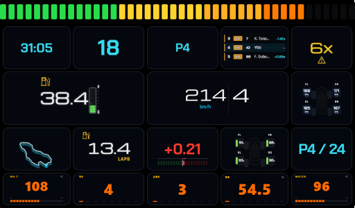 | 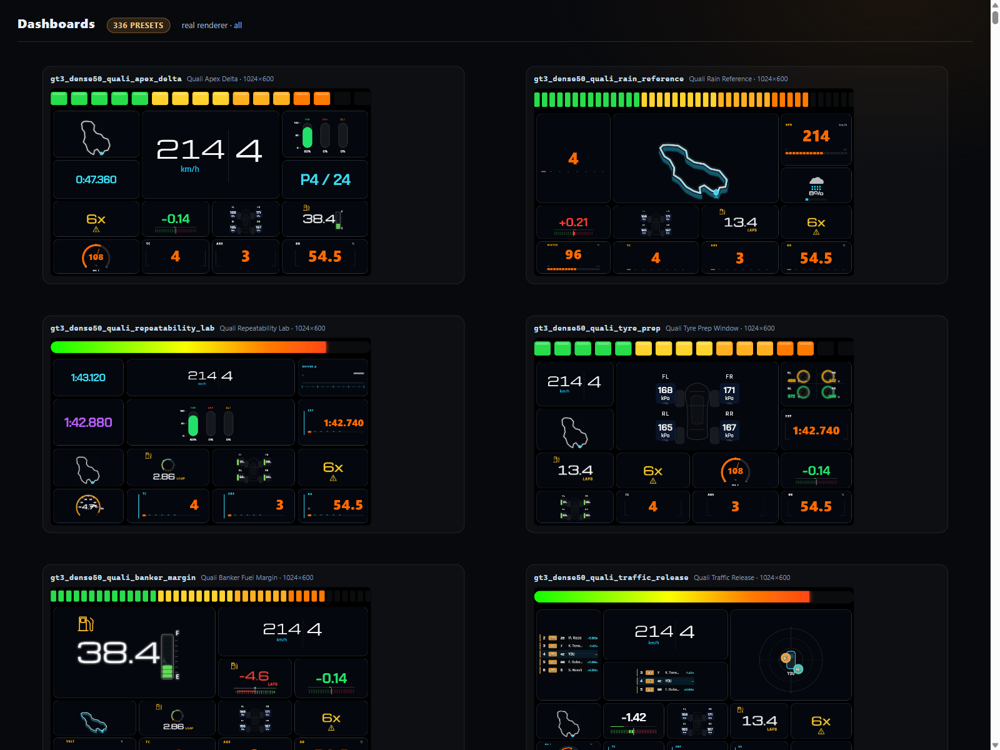 |

| Dashboard management and protected streaming target | Current race-sun preset family |
|---|---|
|  | 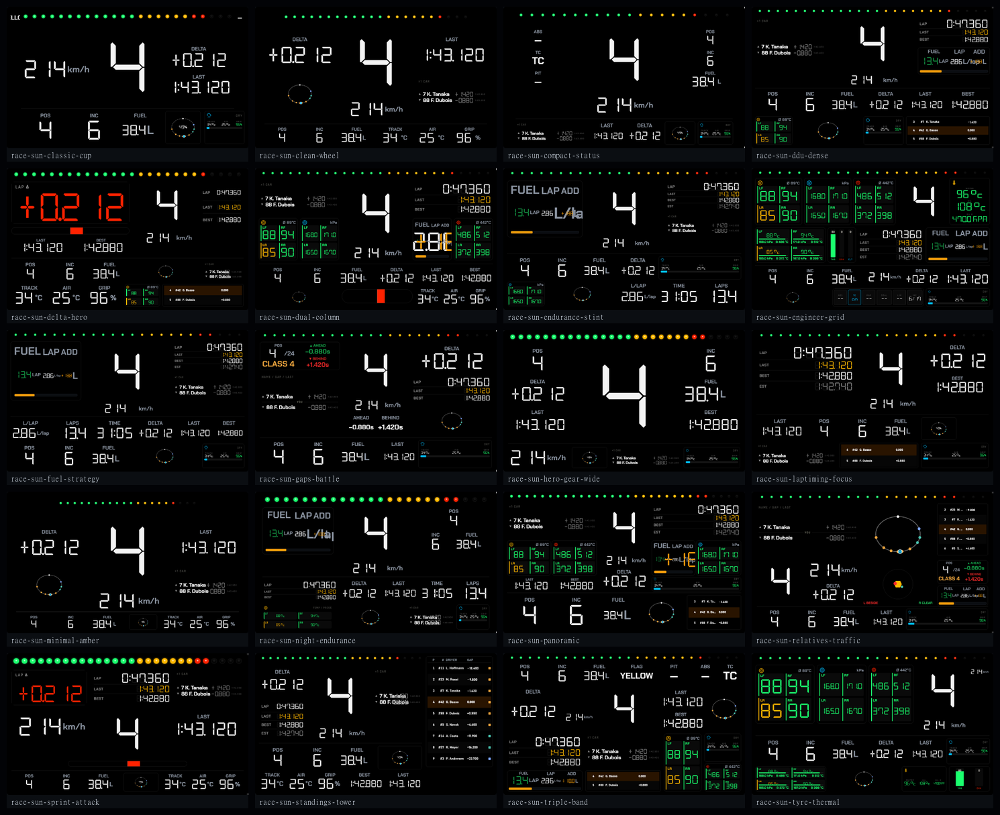 |

| Litre-canonical fuel strategy | Unified alert rules |
|---|---|
| 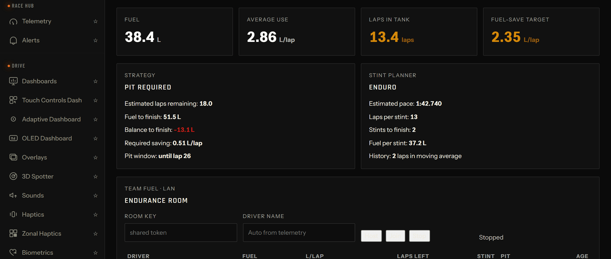 | 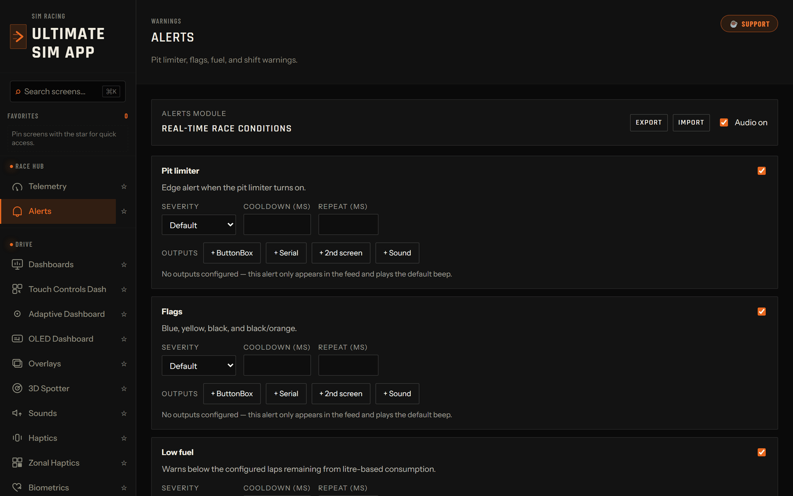 |

| Live telemetry source and diagnostics | Rev-light presets and LED configuration |
|---|---|
|  |  |

| Local AI Coach before the first completed lap | Adaptive dashboard controls |
|---|---|
| 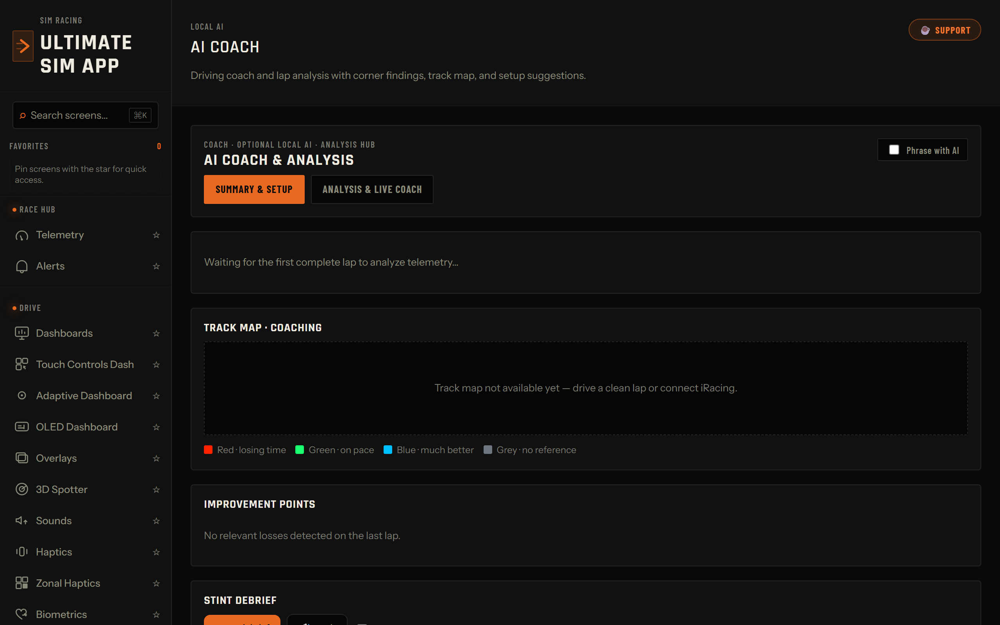 | 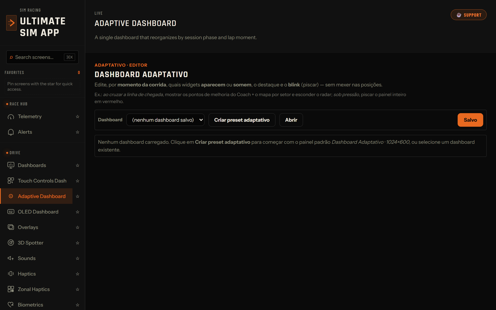 |

| Units and telemetry configuration | Profile backup and saved-configuration safety |
|---|---|
| 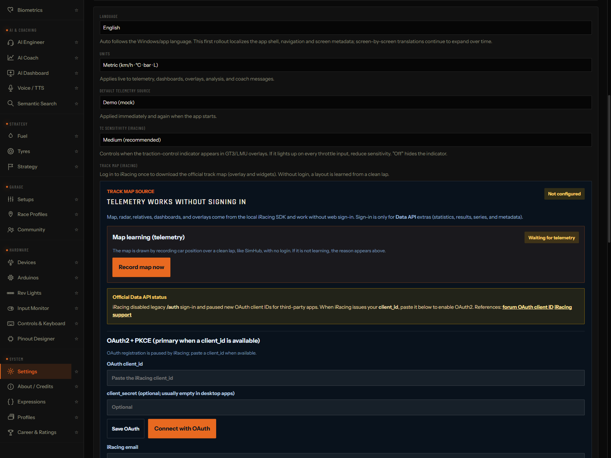 | 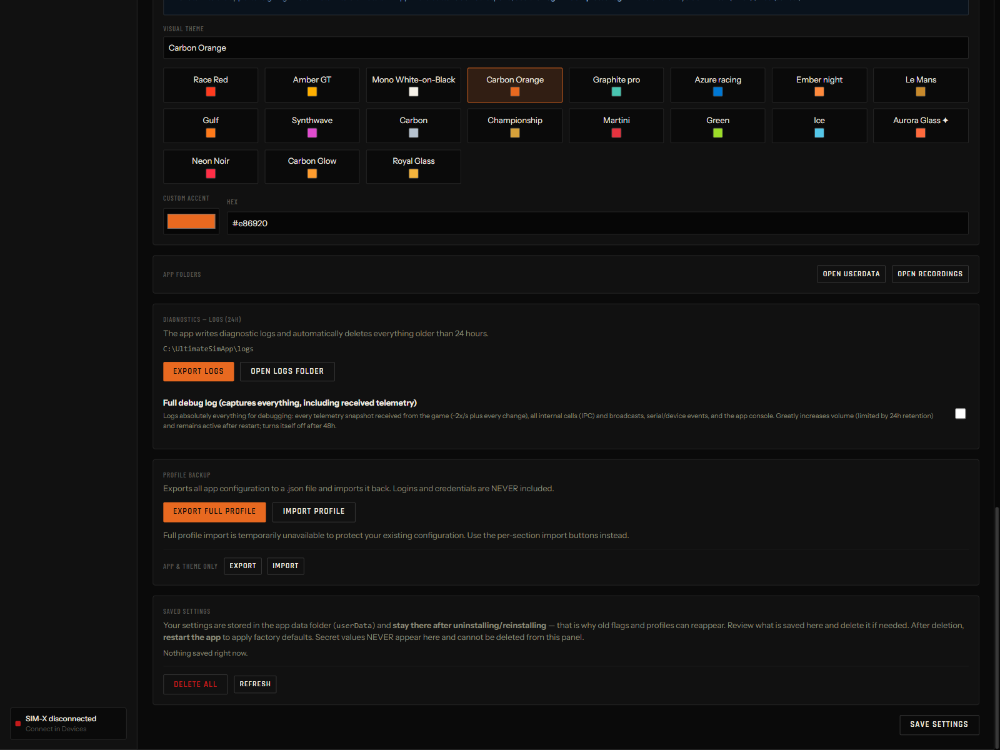 |

| Current overlay widget renderer | All 336 current dashboard presets |
|---|---|
| 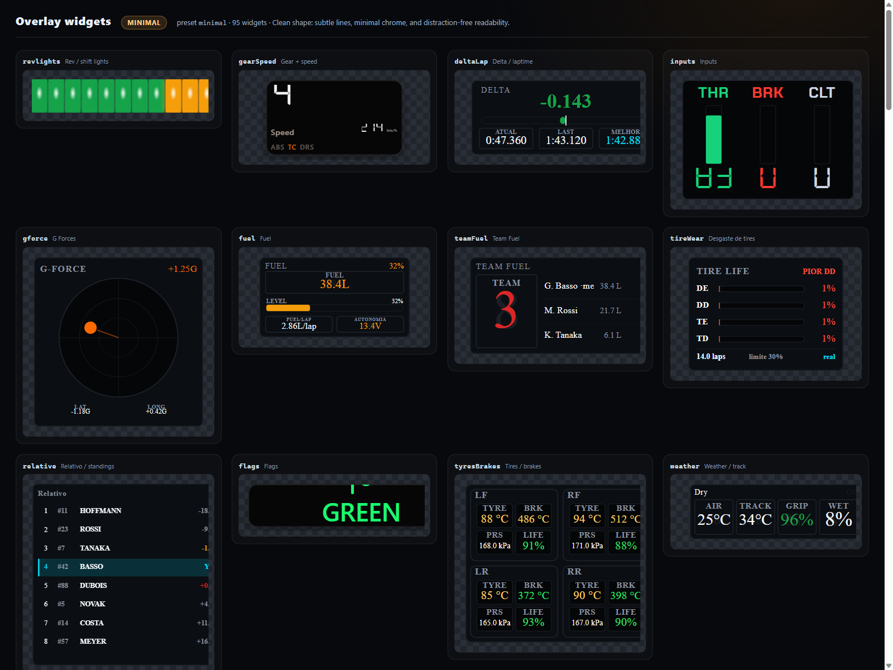 | 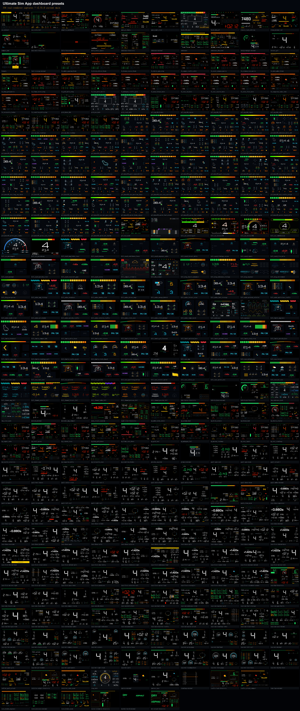 |

| Semantic Touch Controls editor | Expression visualization destinations |
|---|---|
| 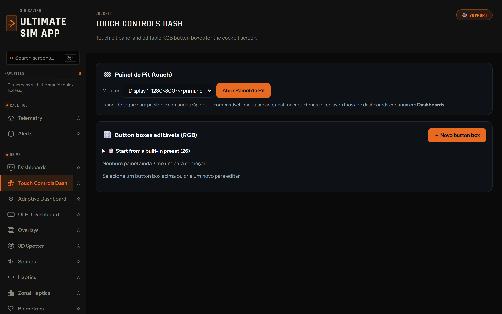 | 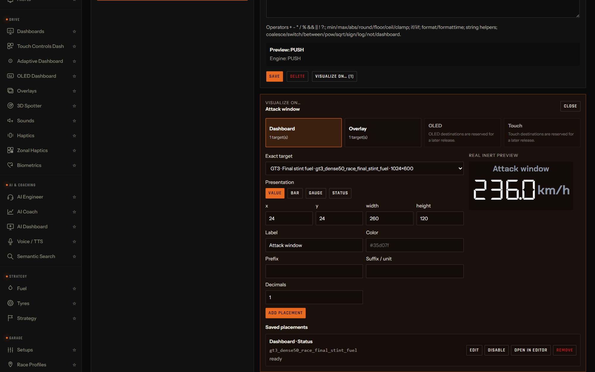 |

---

## Guided tour

### Race hub

- **Telemetry** — source selection for Off, Auto-detect, Demo (mock), iRacing, ACC, Assetto Corsa, and AMS2, plus iRacing diagnostics, with live gear, speed, RPM, position, inputs, lap times, fuel, and relative data. LMU is configured as the default source in Settings or reached through Auto-detect.
- **Alerts** — pit limiter, flags, low fuel, shift warnings, and condition-driven audio/visual notifications.

### Drive

- **Dashboards** — monitor windows, `.simhubdash` import/export, builder/editor, live previews, preset gallery with tag filtering, race playlist, token/password-protected read-only streaming, and open-on-display support.
- **Touch Controls Dash** — cockpit touch panels and RGB button-box layouts for pit commands and app actions.
- **Adaptive Dashboard** — context-aware dashboard behavior that highlights or hides widgets based on race phase and live conditions.
- **OLED Dashboard** — compact 128x64 telemetry pages for ButtonBox OLED hardware.
- **Overlays** — transparent race overlays, trigger-only warnings, compositor mode, and the 3D navigation map.
- **3D Spotter** — spatial awareness cues for nearby cars.
- **Sounds** — shift beeps, incident cues, ABS/TCS cues, and per-car learning.
- **Haptics / Zonal Haptics** — telemetry-driven bass-shaker/tactile output by body zone.
- **Biometrics** — heart-rate and stress-vs-pace tools.

### Strategy and data

- **Fuel / Team Fuel** — fuel used per lap, laps-to-empty, fuel-save target, pit window, stint planning, and same-room-key LAN sharing.
- **Tyres** — wear, temperature/pressure context, degradation, and tyre-driven pit timing.
- **Strategy** — predictive pit windows, margins, undercut/overcut hints, and race context.
- **Career & Ratings** — iRating, Safety Rating, licenses, incidents, and results history.
- **Race Profiles** — per-car/track profiles for bindings, OLED pages, overlays, alerts, and hardware behavior.
- **Setups** — local or URL-based setup installation workflows.
- **Community** — local-first ghosts, telemetry, and setup sharing through `.simshare` files.
- **Expressions** — CSP-safe custom fields and conditions without `eval`, transaction-safe imports, revision conflict protection, and explicit Dashboard/custom Overlay visualization destinations.

### Local AI

The AI Engineer, AI Coach, lap analysis, semantic search, and adaptive selections are designed to run locally on the CPU. No cloud API key is required for the built-in local flow.

- **AI Engineer** — text race engineer for fuel, tyres, gaps, and strategy.
- **AI Coach** — intent- and racecraft-aware driving coach for overtake, defend, general improvement, and qualifying context, with confidence, silence when unsure, Turn+Sector grounding, local per-car/track baselines, and replay/live fencing.
- **AI Dashboard Builder** — dashboard generation from text, with offline fallback behavior.
- **Semantic Search** — meaning-based search with keyword fallback.
- **Voice / TTS** — offline voices where available, system fallback, and language-synchronized Spotter, Coach, Engineer, preview, and Stint Debrief speech.

### Hardware and app

- **Devices** — USB/serial detection and ButtonBox selection.
- **Arduinos / ESP32** — hardware hub for RGB, matrices, displays, gauges, controls, pinout, and firmware generation.
- **Rev Lights** — LED configuration and race-style presets.
- **Input Monitor** — live Web Gamepad API validation.
- **Controls & Keyboard** — button-to-key, virtual gamepad, iRacing command, and app-action mapping.
- **Pinout Designer** — low-code pin mapping for LEDs, encoders, multiplexers, and displays.
- **Profiles** — save and load hardware/race configurations.
- **Settings** — updates, startup behavior, tray behavior, telemetry defaults, Metric/Imperial/US units, language, theme, and saved-configuration safety controls.
- **About / Credits** — licenses, fonts, and third-party component credits.

---

## Project layout

| Area | Path | Description |
|---|---|---|
| Desktop app | `app-v2/` | Electron + React + TypeScript Windows app. |
| Firmware | `firmware/` | Arduino sketches for the ButtonBox and companion modules. |
| Driver helper | `driver/` | Optional INF package for friendly COM-port naming using the Windows inbox `usbser.sys`. |
| Protocol docs | `docs/` | Serial protocol and implementation notes. |
| SimHub config | `simhub/` | Custom serial template for OLED telemetry. |
| CAD/print files | `cad/`, `print/` | 3D-printable enclosure sources/assets. |

---

## Languages

The language selector supports **pt-BR, en, es, fr, de, zh, and ja**. `Auto` follows the operating-system language and falls back to English. Translation coverage is incremental, so some screens may still use English or legacy strings. Change language in **Settings** and restart when prompted.

---

## Current limitations

- Windows 10/11 x64 is the supported telemetry, hardware, packaging, and update target. Other platforms can inspect parts of the UI in development/demo mode but are not release targets.
- iRacing has the deepest normalized telemetry. ACC, Assetto Corsa, AMS2, and LMU support depends on each provider and should not be inferred from the full governed iRacing registry. Opponent throttle, brake, and steering are not exposed; opponent steering remains unsupported.
- Transparent overlays require Windowed or Borderless mode; exclusive fullscreen cannot display normal Windows overlay windows.
- Full-profile import remains disabled to protect existing configuration. Per-section import/export and full-profile export remain available.
- Internet streaming requires a token, password, and active HTTPS endpoint. Hardware, authenticated services, and simulator-only behavior still require validation on the real rig.
- The local AI path needs compatible CPU resources and downloaded local models; deterministic fallbacks remain available when a model is unavailable. The 50-dashboard / 16,600-visual Phase 02 production program is still in development.

---

## Install and update

1. Open the [latest published release](https://github.com/guilhermerbasso/ultimate-sim-app/releases/latest).
2. Choose `Ultimate-Sim-App-<version>-x64.exe` for the per-machine Windows installer, or the matching portable x64 `.zip`. The installer may request administrator elevation and creates Start menu/desktop shortcuts; application data remains under `%APPDATA%\ultimate-sim-app`.
3. Unsigned community builds may trigger Windows SmartScreen. Confirm the repository/release URL and version before choosing **Run anyway**.
4. Launch the app and choose Auto-detect, Demo, iRacing, ACC, Assetto Corsa, or AMS2 on the Telemetry page. For LMU, select it as the default source in Settings or use Auto-detect. Use Borderless or Windowed mode for overlays.
5. Existing installed builds check the latest **published** GitHub release at startup, every four hours, and from **About → Check for updates**. Draft releases are intentionally invisible to auto-update; a valid release must publish the matching `.exe`, `.zip`, `.exe.blockmap`, and `latest.yml` together.
6. If an interrupted update reports a missing file such as `icudtl.dat`, run the complete matching installer manually as administrator. Do not delete `%APPDATA%\ultimate-sim-app`; it is separate from the program directory.
7. Open a dashboard on another display or start streaming. LAN/Internet streaming requires a password in addition to the generated token and HTTPS for public exposure.
8. Connect SIM-X/ButtonBox/Arduino/ESP32 hardware if you use physical controls, rev lights, OLED, haptics, or LEDs.

See [`MANUAL.md`](MANUAL.md) for basic installation and ButtonBox/SimHub hardware guidance.

---

## Development setup

Requirements: Node.js 24.x, npm, Git, Bash (Git Bash on Windows), network access for verified runtime-asset downloads, and Windows 10/11 x64 for telemetry and final installer validation.

```bash
cd app-v2
npm ci
npm run dev
```

Useful checks:

```bash
npm run typecheck
npm run test
npm run build
npm run visual:dash
npm run visual:widgets
npm run visual:touch
```

Build the Windows NSIS installer:

```bash
cd app-v2
npm run dist:win
```

The Windows build downloads and verifies required runtime binaries, then produces the NSIS `.exe`, portable `.zip`, `.exe.blockmap`, and mandatory `latest.yml` auto-update feed in `app-v2/dist-win/`.

---

## Screenshot and visual-audit tooling

The README screenshots are produced from `app-v2/visual-audit/`:

```bash
cd app-v2
node visual-audit/shoot-views.mjs
node visual-audit/shoot-dashboards.mjs
node visual-audit/shoot.mjs minimal
```

`shoot-views.mjs` captures all 34 registered app views and writes candidate images directly to `app-v2/docs/screenshots/`; review and keep only useful frames. `shoot-dashboards.mjs` renders every `BUILTIN_PRESETS` dashboard through the production dashboard renderer (336 on the v2.53.0 release branch) and writes individual captures, category contact sheets, and a report under ignored `app-v2/visual-audit/` output folders. `shoot.mjs minimal` validates the real overlay-widget gallery plus representative dashboards under the ignored `shots/` folder.

The committed gallery and contact-sheet images are curated from those real-renderer outputs using the existing image tooling. The v2.53.0 app-view frames are optimized at 1600 pixels wide (up to 1600×1000), while the GT3 dashboard frame is kept at its native 1024×600 canvas. Standalone files under `visual-audit/hifi/` are audit fixtures and are not used for the current README screenshots.

---

## Hardware and firmware

The reference ButtonBox uses:

- Arduino Pro Micro / Leonardo-compatible ATmega32U4 board
- 6 EC11 rotary encoders with push buttons
- SSD1306 OLED display
- CD74HC4067 multiplexer

Firmware and wiring docs live under `firmware/`, `docs/`, `simhub/`, `BOM.*`, and `WIRING.*`.

---

## Contributing

Contributions are welcome. Start with [`CONTRIBUTING.md`](CONTRIBUTING.md), follow the [`CODE_OF_CONDUCT.md`](CODE_OF_CONDUCT.md), and use [`SECURITY.md`](SECURITY.md) for private vulnerability reporting. Open an issue for larger changes and keep pull requests focused; the maintainer reviews and merges them.

Generated dependencies and build outputs (`node_modules/`, `app-v2/out/`, `app-v2/dist-win/`, logs/caches, visual-audit outputs) are intentionally not committed. CI runs typecheck, tests, build, security analysis, and Windows package checks. Releases must attach the same-build `.exe`, `.zip`, `.exe.blockmap`, and **`latest.yml`**; see [`docs/RELEASING.md`](docs/RELEASING.md).

---

## Support and community

- [Report a bug or request a feature](https://github.com/guilhermerbasso/ultimate-sim-app/issues/new/choose)
- [Join the Discord community](https://discord.gg/Wy7d5rTgwS)
- Report security issues privately through [`SECURITY.md`](SECURITY.md)

## Support development

If this project helps your sim racing setup, you can support development here:

[](https://buymeacoffee.com/bettercalllbasso)

## License

Licensed under the Apache License, Version 2.0. See [`LICENSE`](LICENSE).
