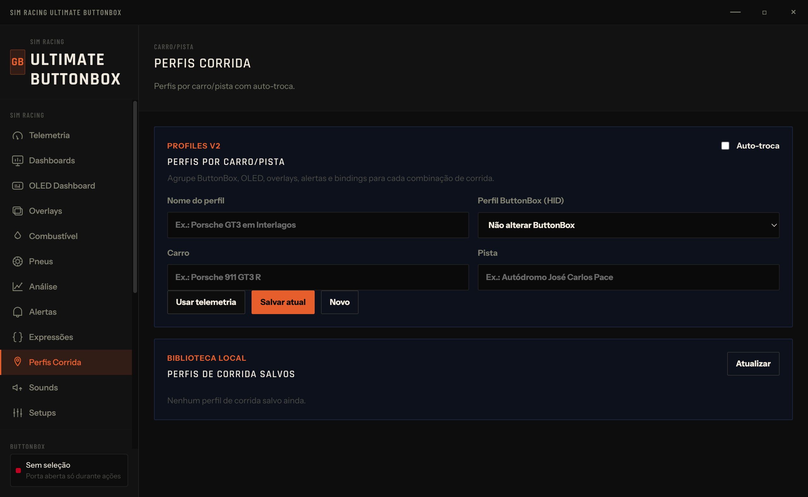
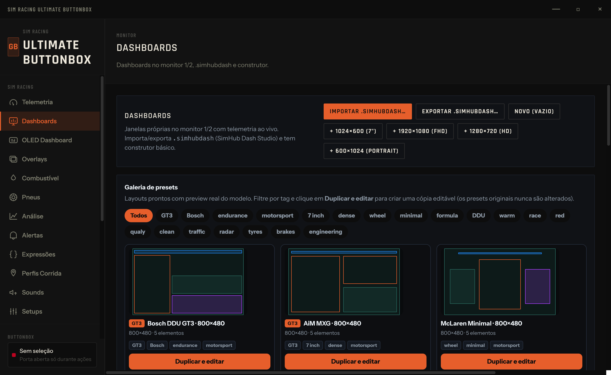
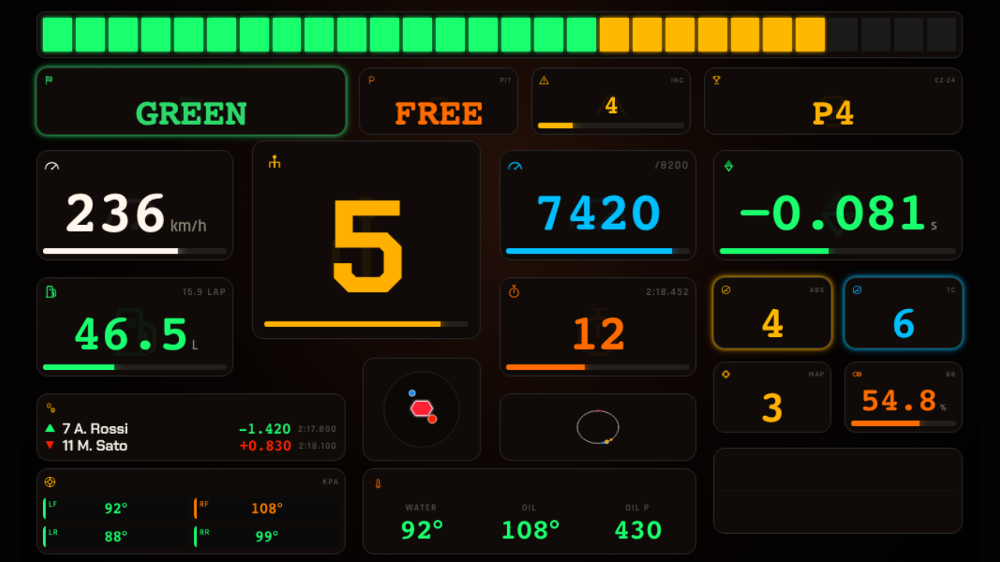
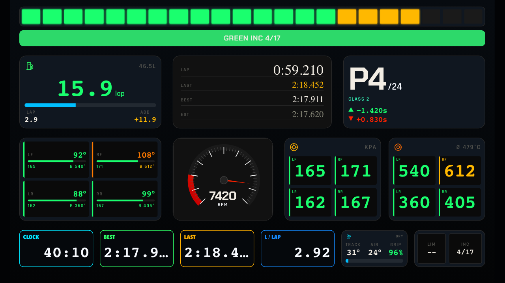
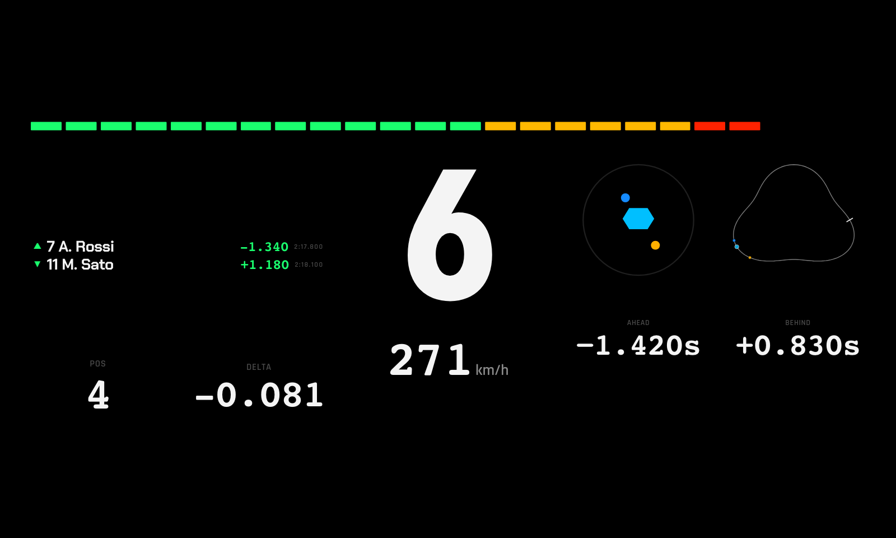
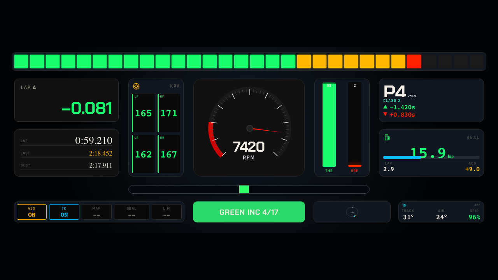
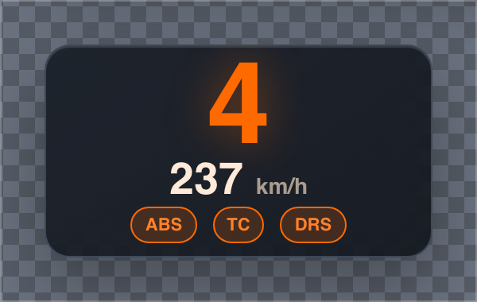
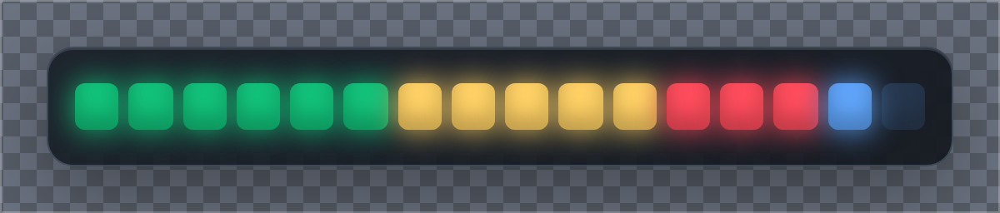
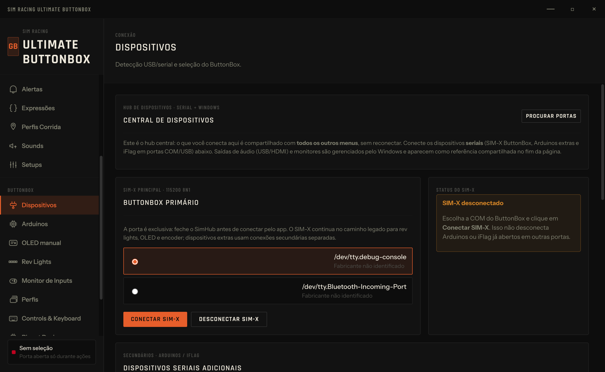
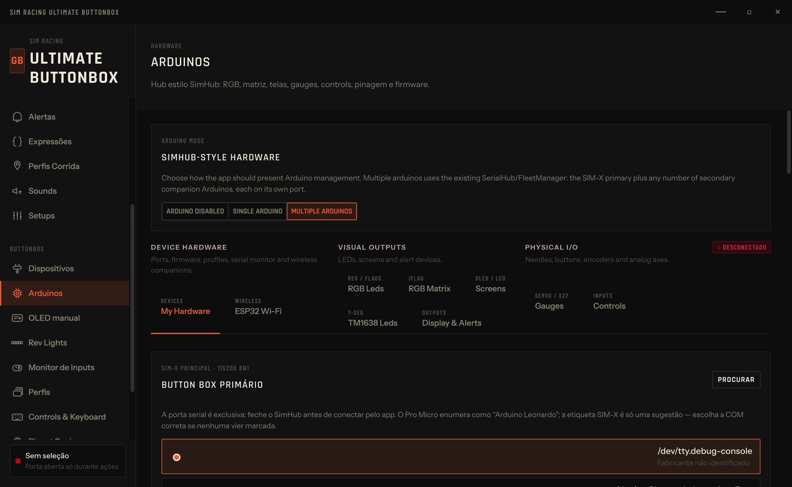

# Ultimate Sim App

Ultimate Sim App is a Windows companion app and DIY hardware project for sim racing. It combines telemetry, overlays, dashboards, strategy tools, and configuration support for a USB ButtonBox based on Arduino-compatible hardware.

This is an independent community project maintained by Guilherme Basso.

## What is included

| Area | Path | Description |
|---|---|---|
| Desktop app | `app-v2/` | Electron + React + TypeScript Windows app. |
| Firmware | `firmware/` | Arduino sketches for the ButtonBox and companion modules. |
| Driver helper | `driver/` | Optional INF package for friendly COM-port naming using the Windows inbox `usbser.sys`. |
| Protocol docs | `docs/` | Serial protocol and implementation notes. |
| SimHub config | `simhub/` | Custom serial template for OLED telemetry. |
| CAD/print files | `cad/`, `print/` | 3D-printable enclosure sources/assets. |

## Main features

- Sim racing dashboard, overlay, telemetry, and strategy companion.
- ButtonBox configuration and serial communication tools.
- OLED telemetry payload support for compatible firmware.
- Input monitoring through the Web Gamepad API.
- Optional USB/COM friendly-name setup for Windows.
- Build workflow for Windows NSIS installers.

## Screenshots

| AI coach / driver insights | Voice spotter |
|---|---|
|  |  |

| Telemetry workspace | Strategy and stint tools |
|---|---|
|  |  |

| Dashboard gallery | Overlay manager |
|---|---|
|  |  |

| GT3 race dashboard | Endurance dashboard |
|---|---|
|  |  |

| Spotter dashboard | Formula dashboard |
|---|---|
|  |  |

| Overlay: gear and speed | Overlay: rev lights |
|---|---|
|  |  |

| Devices | Arduino setup |
|---|---|
|  |  |

| Pinout designer | Controls and keyboard mapping |
|---|---|
|  |  |

## Quick start for users

1. Download a trusted release build when available.
2. Install or unzip the Windows package.
3. Connect the ButtonBox by USB.
4. Open Ultimate Sim App and select the device/COM port.
5. Keep SimHub closed while configuring the serial device, then close/disconnect the app before racing if SimHub needs the same COM port.

See the full user guide in [`MANUAL.md`](MANUAL.md).

## Development setup

Requirements:

- Node.js 20+
- npm
- Git
- Windows 10/11 for final installer validation

```bash
cd app-v2
npm install
npm run dev
```

Useful checks:

```bash
npm run typecheck
npm run test
npm run build
```

Build the Windows installer:

```bash
cd app-v2
npm run dist:win
```

## Hardware and firmware

The reference ButtonBox uses:

- Arduino Pro Micro / Leonardo-compatible ATmega32U4 board
- 6 EC11 rotary encoders with push buttons
- SSD1306 OLED display
- CD74HC4067 multiplexer

Firmware and wiring docs live under `firmware/`, `docs/`, `simhub/`, `BOM.*`, and `WIRING.*`.

## Repository hygiene

Generated dependencies and build outputs are intentionally not committed:

- `node_modules/`
- `app-v2/out/`
- `app-v2/dist-win/`
- logs, caches, temporary files, and OS metadata

Release installers should be generated from source and attached to GitHub Releases after review.

## Contributing

Contributions are welcome. Start with [`CONTRIBUTING.md`](CONTRIBUTING.md), open an issue for larger changes, and keep changes focused.

Pull requests must be reviewed and approved by the maintainer before merge.

## Support

If this project helps your sim racing setup, you can support development here:

[](https://buymeacoffee.com/bettercalllbasso)

## License

Licensed under the Apache License, Version 2.0. See [`LICENSE`](LICENSE).
